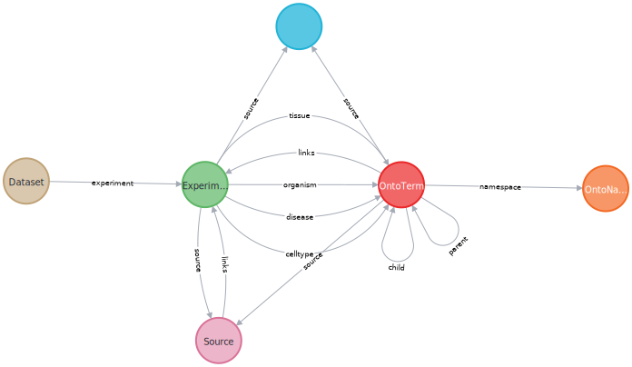

# kokoro: Ontology based search for Single-cell datasets

Single-cell datasets may be annotated at varying levels of cell type resolution, either due to limitations in the available ontology at the time of annotation or subsequent updates to ontologies.

For instance, a dataset may be associated with multiple cell types such as [B cell](https://www.ebi.ac.uk/ols/ontologies/efo/terms?iri=http%3A%2F%2Fpurl.obolibrary.org%2Fobo%2FCL_0000788), [plasma cells](https://www.ebi.ac.uk/ols/ontologies/efo/terms?iri=http%3A%2F%2Fpurl.obolibrary.org%2Fobo%2FCL_0000980) or [Follicular cells](https://www.ebi.ac.uk/ols/ontologies/efo/terms?iri=http%3A%2F%2Fpurl.obolibrary.org%2Fobo%2FCL_0000843), all falling under the broader category of [mature B-cells](https://www.ebi.ac.uk/ols/ontologies/efo/terms?iri=http%3A%2F%2Fpurl.obolibrary.org%2Fobo%2FCL_0000785). This diversity in annotation resolution poses a challenge when trying to locate datasets, and a similar issue can arise in other annotations tied to ontologies, such as tissues or diseases.

To address this challenge, ontologies are represented as graphs, enabling the use of graph traversal techniques for searching. For instance, one can employ broad search terms like "mature B cells" to identify datasets of interest within this hierarchy.

Kokoro employs Neo4j to model ontologies as graphs for cell types, diseases, and tissues. This framework accommodates multiple ontology versions within the same graph database. Leveraging Neo4j enables the application of graph traversal techniques to identify nodes of interest, whether they are datasets or specific terms.

The system employs [`neo4j-graphql`](https://neo4j.com/developer/graphql/) to map the graph schema to a GraphQL model, and the API layer utilizes [Apollo](https://www.apollographql.com/docs/).

### Data model

```cypher
  # neo4j cypher query to visualize the schema
  CALL db.schema.visualization
```



In this data model, ontology terms, referred to as `OntoTerm`, are represented as a graph. A key component of this graph is the links to datasets/experiments (`blue` node), which is linked to the terms through relationships e.g., cell type, disease or tissue.

This simple design allows for a seamless connection between datasets and the associated ontology terms, facilitating efficient exploration and retrieval of relevant information. To tailor the ontology representation to specific application needs, check out the customization options in the ontology section detailed below.

Our datasets use the [MAE representation](https://bioconductor.org/packages/release/bioc/html/MultiAssayExperiment.html) from Bioconductor, hence the use of separate `Dataset` and `Experiment` nodes.

# Search the graph

**_Note: Apollo includes an integrated GraphQL IDE for executing various queries.._**

Once the system is running, the GraphQL IDE is accessible at [http://localhost:4000/graphql](http://127.0.0.1:4000/graphql).

### Search for datasets

To locate datasets associated with "macrophages," you can use the following GraphQL query:

```graphql
query {
  experiments(
    where: { celltypes: { name: "macrophage" } }
    options: { offset: 0, limit: 10 }
  ) {
    id
    title
  }
  datasetsCount(where: { celltypes: { name: "macrophage" } })
}
```

A variation of this query allows you to search across multiple annotations simultaneously:

```graphql
query {
  experiments(
    where: {
      celltypes: { name: "macrophage" }
      diseases: { name: "colorectal cancer" }
      tissues: { name: "colon" }
    }
    options: { offset: 0, limit: 10 }
  ) {
    id
    title
  }
  datasetsCount(
    where: {
      celltypes: { name: "macrophage" }
      diseases: { name: "colorectal cancer" }
      tissues: { name: "colon" }
    }
  )
}
```

The above queries function without requiring custom code, thanks to the mapping provided by Neo4j and its GraphQL library. However, the examples below introduce new GraphQL operations to conduct more complex searches.

### Search across entities with (AND/OR)

A more complex example involves finding datasets linked to the cell type "Oligodendrocyte Precursor Cell (CL:0002453)" and either "lung cancer (DOID:1324)" or "lymphoma (DOID:0060058)".

```graphql
{
  searchExperiments(
    celltypes: ["CL:0002453"]
    cellTypeOperation: "OR"
    diseases: ["DOID:1324", "DOID:0060058"]
    diseaseOperation: "OR"
  ) {
    id
    organism
    title
    celltypes {
      name
    }
    tissues {
      name
    }
    diseases {
      name
    }
  }
}
```

Achieving this requires custom resolvers to manage such operations. You can refer to the [resolver code](./graphql/api/searchDB.js) for an example of how to add custom operations.

### Are these terms related ?

To determine if two terms are related, you can use a query like this:

```graphql
query {
  hasRelation(start: "BFO:0000020", end: "EFO:0002012")
}
```

This query doesn't require a custom resolver; instead, you can use the @cypher directive to write such queries within the model. Refer to [this example](./graphql/api/model.js) for the usage of this directive.

All operations support pagination using `limit` and `offset` parameters

## Ontologies

Building the ontology graph is a one time operation, unless you intend to update it with new releases. The scripts for constructing this graph are accessible [here](./scripts/onto.py). You can customize these scripts as needed to suit your requirements.

We support various ontologies, including:

- Experiment Factor Ontology: EFO
- Cell Ontology: CL
- Uber-anatomy Ontology: UBERON
- Human Disease Ontology: DOID
- Monarch Disease Ontology: MONDO

You can find these ontologies in the [scripts](./scripts/ontologies/) directory.

# Installation

To set up the system:

- Clone the repository to your local environment.
- Make any necessary adjustments to the [scripts](./scripts/) or the [docker-compose file](./docker-compose.yml) file to tailor it to your specific needs.
- Launch the instance by running docker:

```
docker-compose up 

# or depending on your version of docker compose
docker compose up
```

Construct the Ontology graph using the `onto.py` script.
